# Tech Academy - Live Project

## Introduction

During my last two weeks studying at The Tech Academy I had the opportunity to work with a group of my peers on an ASP.NET MVC application developing with C# and JavaScript. The project involved working with a local theater company developing a CMS to manage their productions, list of theater events, cast, and other content related to managing a small theater company. During the two-week sprint I had the opportunity to work on several stories targeting both the front-end and back-end, varying in the number of points assigned to them. Over the course of the sprint I was able to utilize several technologies on the back-end involved in ASP.NET MVC applications aside from C#, including Entity Framework and Razor Pages, and several technologies and frameworks on the front-end including Bootstrap and jQuery. I also had the opportunity to implement several design patterns and ASP.NET features, such as Data Transfer Objects or DTOs and Partial Views.

## Front-End Stories

* [Restrict Subcriber Menu Access to Subscribers](#restrict-subscriber-menu)
* [Bulk Add Event: Conflict Detection](#conflict-detection)
* [Production Comments Feature: Front-End Portion](#production-comments)

### Restrict Subscriber Menu

This was my first story and was a simple change to restrict the Subscriber menu from being visible when a user had a role of "User". 

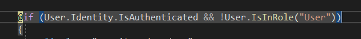

### Conflict Detection

This was a moderately sized story that involved conflict detection so that when a Production event was bulk added to the calendar, if a generated event overlapped with an existing event on the calendar the user would be notified that a conflict existed and the generated event would be removed from the list of events to be added to the calendar. The implementation was straight-forward enough once I was able to come up with a solution for detecting the conflicts, which involved utilizing a MapReduce approach and then filtering out the conflicted events.

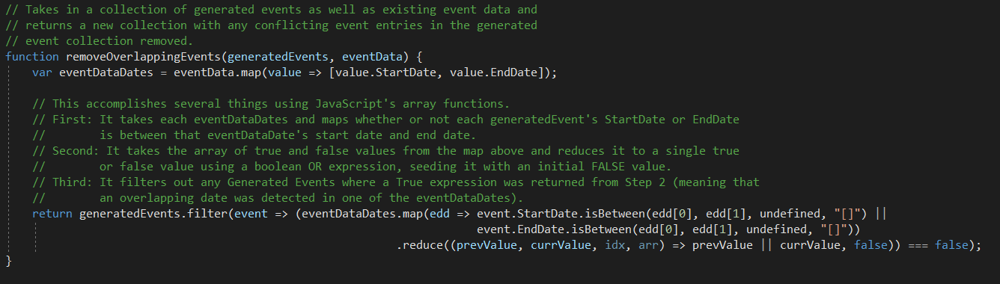

This story also involved normalizing incoming calendar event data fetched via an AJAX call into a CalendarEvent object in order to be able to be utilized later in the code.

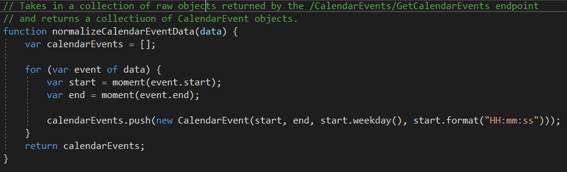

This story also involved updating a method, `createTable`, to notify the user of the overlapping events.

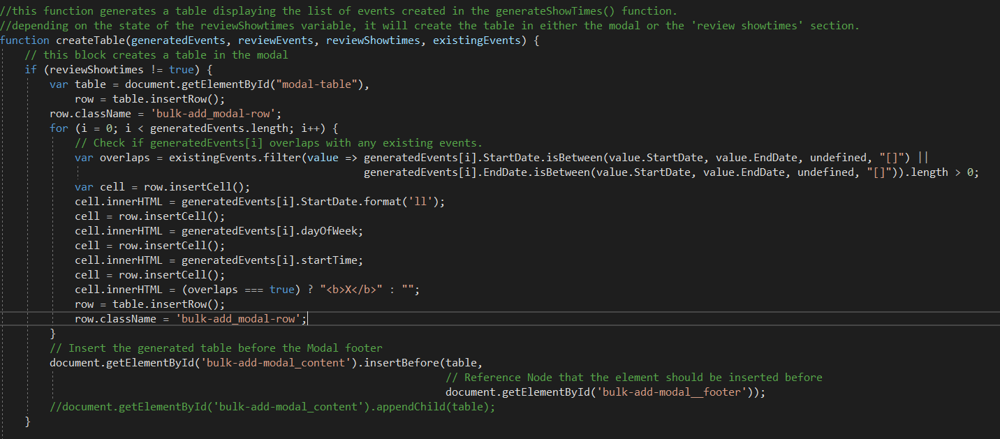

### Production Comments

 This story involved adding the front-end support for allowing users to post comments to a Production as well as post replies to comments posted to a production. This features live updates so that when a user posted a comment or a reply the page refreshes just the comment portion of the page without a full page refresh. This was accomplished utilizing Partial Views on the backend and jQuery on the front-end. 

 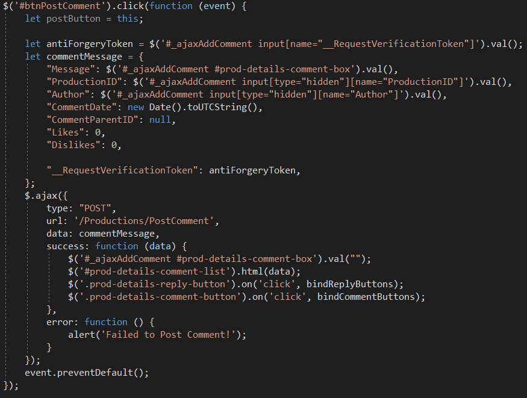

 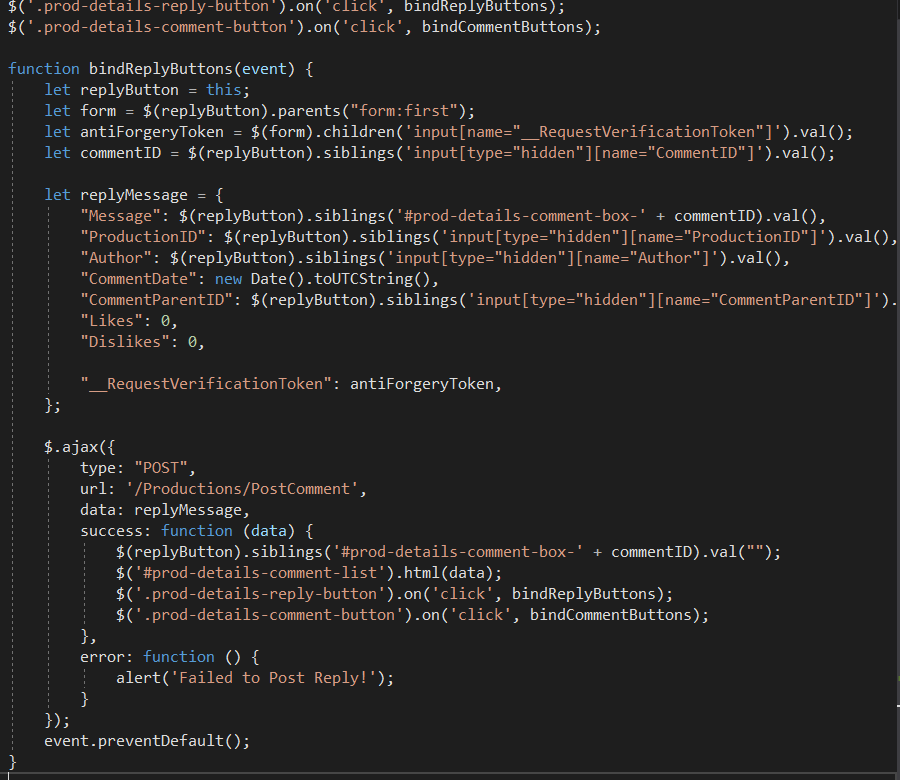

 As mentioned, I utilized Partial Views to implement the live updates to the page for updating the comments.

 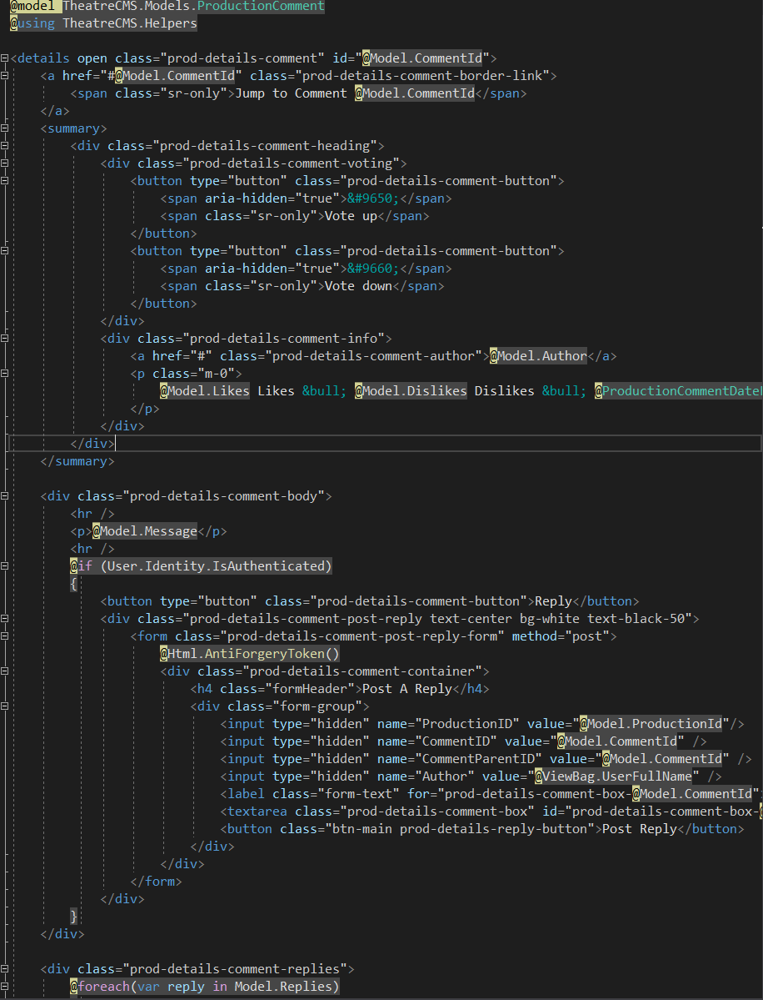

 ## Back-End Stories

 * [Production Comment Section: Back-End Portion](#production-comments)

 ### Production Comments

 This story involved adding the back-end support for allowing users to post comments to a Production as well as post replies to a Production. This involved working with Entity Framework for adding the Model.

 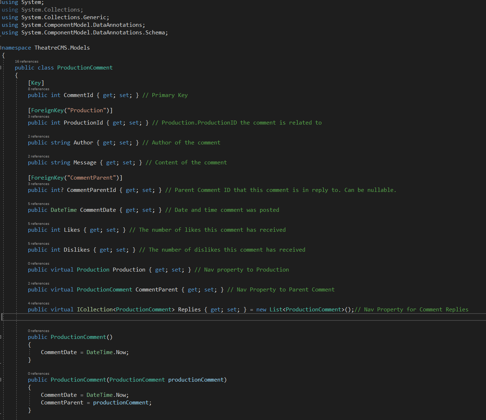
 
 This also involved creating endpoints to support Posting a comment / reply as well as fetching comments.

 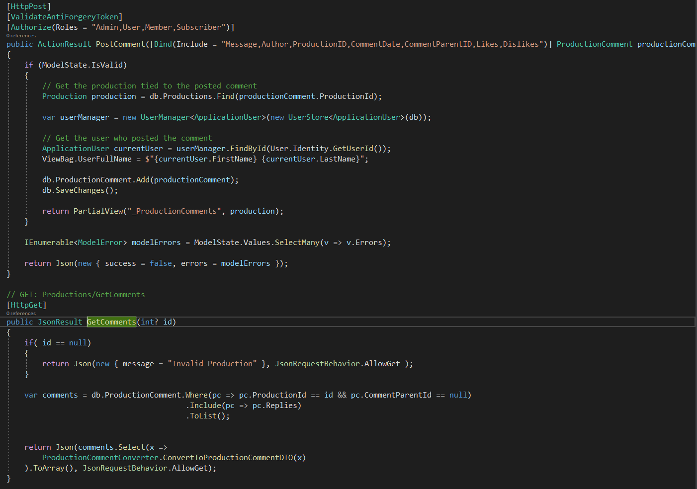
 
 I also created a Data Transfer Object for serializing the Model for rendering out a ProductionComment as well as the associated helper class for converting a ProductionComment to a ProductionCommentDTO.

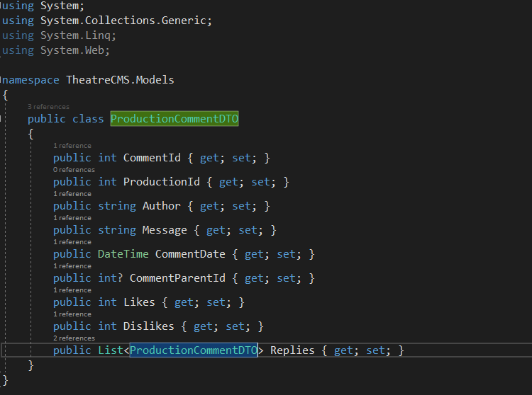

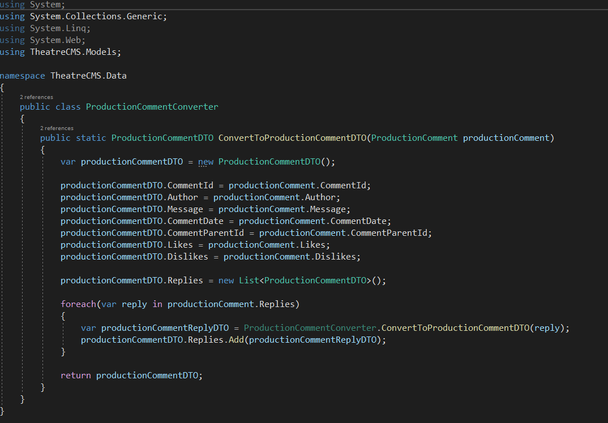

 I also created a Helper class for taking in a ProductionComment and creating a text for displaying how long ago a comment was posted.

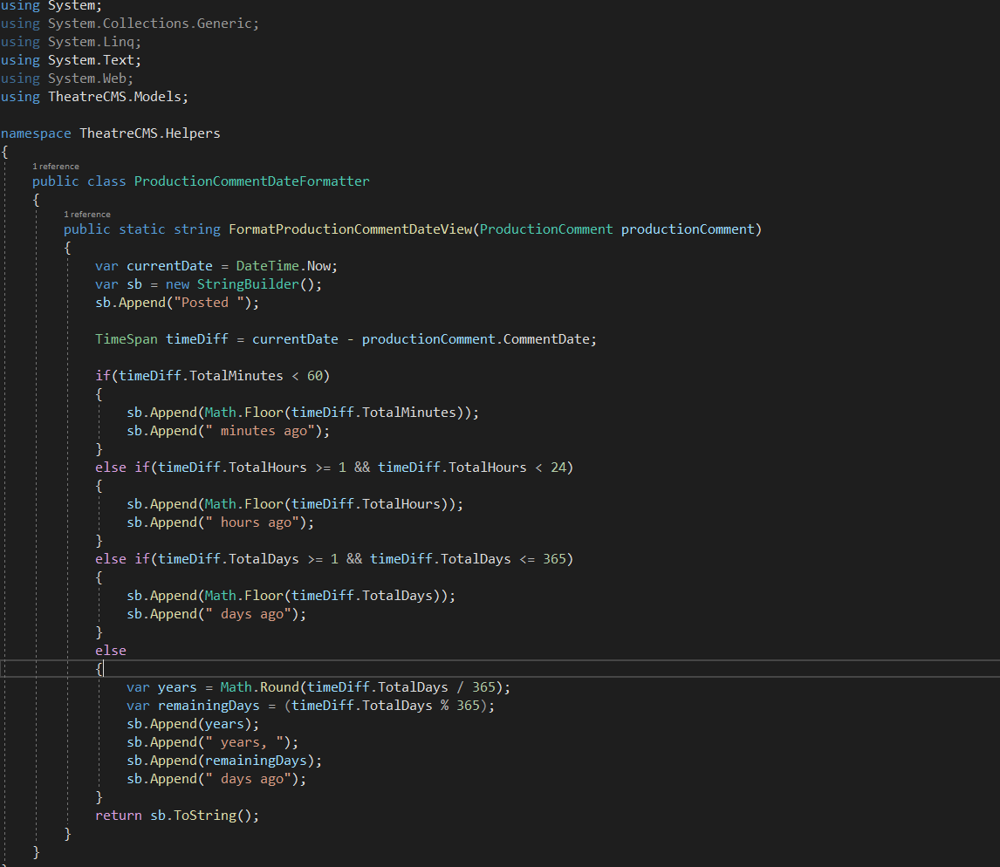

## Skills Learned

* Effective communication during stand-ups and retrospectives. Communication was essential to make sure that any roadblocks were conveyed as well as my current progress was made aware to the rest of the team.
* Data modeling with Data Transfer Objects and proper encapsulation of models when transfering objects to a view. It was necessary to ensure that only the necessary information from the model was transferred to the user, and that, for example, the necessary data from the Comment's Replies were loaded so that circular references were avoided in the code.
* Use of the jQuery library and usage of CSS selectors. Implementation of the live updates of the comments as well as implementing the reply feature involved quite a bit of usage of the jQuery library to fetch the necessary values from the form as well as rebinding of the events after the data was reloaded into the DOM. This required quite a bit of research into the usage of the jQuery library and how to properly select elements from the HTML document.
* Proper version control and merge conflict resolution techniques. While I had prior experience with Git and version control, I had the opportunity to improve my workflow and key in on several areas where I had inefficiencies and improve on my understanding on Git. I also had the opportunity to utilize Visual Studio's tools for Git VCS management to resolve merge conflicts as well as managing my Git repo.
* Razor Page syntax and use of Partial Views. I made heavy usage of Razor page syntax in constructing the Production Comment section and Partial views were essential for implementing the threaded comment model for displaying the comments and their respective replies. This allowed me to greatly expand on my understanding of Razor Syntax and the usage of Partial Views within the ASP.NET MVC framework.